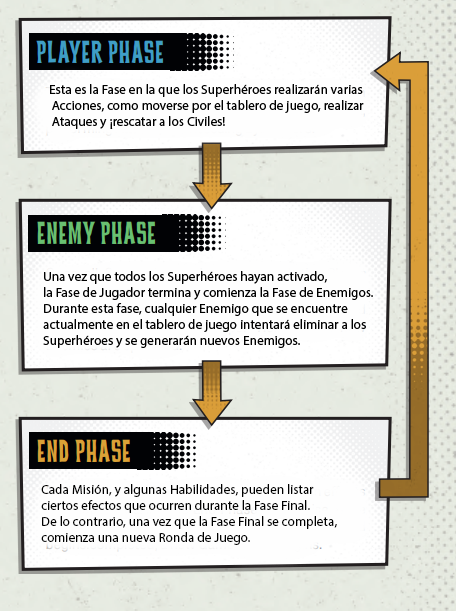

# Descripción general

**RESUMEN DEL JUEGO**

**GANAR Y PERDER** El juego se gana inmediatamente cuando se han completado todos los objetivos de la Misión. El juego se pierde cuando todos los Superhéroes han sido eliminados o cuando se cumple una condición de derrota específica de la Misión. Este es un juego cooperativo, por lo que todos los jugadores ganan o pierden juntos.

**RONDA DEL JUEGO** _DCeased - Un juego de Zombicide_ se juega en una serie de rondas, que proceden de la siguiente manera:

<figure><figcaption></figcaption></figure>
