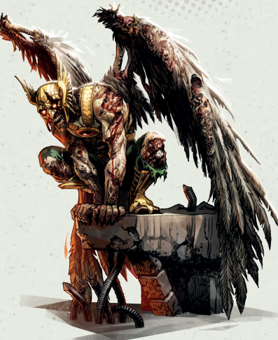
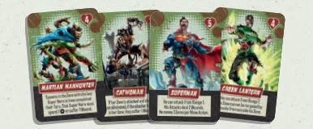

# Enemigos

### ENEMIES

<figure><figcaption></figcaption></figure>

Hay 4 tipos de enemigos. La mayoría de los enemigos tienen una sola acción que realizan cuando se activan. Las excepciones a esto son los Runners y los Zombie Heroes, quienes tienen 2 acciones por activación. Un enemigo es eliminado tan pronto como se le asigna un número suficiente de golpes durante una única acción de ataque para igualar su valor de resistencia. El superhéroe que elimina al enemigo gana 1 punto de experiencia, excepto en el caso de los Zombie Heroes, que otorgan experiencia igual a su valor de resistencia.

#### WALKER

Los LexCorp Troopers pueden ser lentos y débiles, pero el verdadero peligro de los Walkers está en sus números.

<figure><figcaption></figcaption></figure>

* **Acciones:** 1
* **Resistencia:** 1
* **Recompensa de XP:** 1

#### BRUTE

<figure><figcaption></figcaption></figure>

Los LexCorp Heavy Troopers son fuertes y duros. Estos Brutes son difíciles de derrotar.

* **Acciones:** 1
* **Resistencia:** 2
* **Recompensa de XP:** 1

#### RUNNER

Los LexCorp Shocktroopers son rápidos y letales. Estos Runners son una amenaza real que debe ser priorizada.

<figure><figcaption></figcaption></figure>

* **Acciones:** 2
* **Resistencia:** 1
* **Recompensa de XP:** 1

#### ZOMBIE HERO

Cada Zombie Hero es poderoso y único, pero han sido invadidos por el virus Anti-Vida, lo que los impulsa a destruir toda forma de vida que puedan.

<figure><figcaption></figcaption></figure>

* **Acciones:** 2
* **Resistencia:** `X` (Específico para cada Zombie Hero según se indica en su carta).
* **Recompensa de XP:** Igual a su resistencia.
* **Habilidad Única:** Cada Zombie Hero tiene una habilidad única que está activa mientras estén en el tablero, como se indica en su carta.
