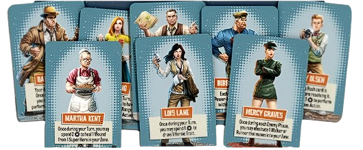

---
layout:
  title:
    visible: true
  description:
    visible: false
  tableOfContents:
    visible: true
  outline:
    visible: true
  pagination:
    visible: true
---

# Espectadores

**Los civiles** representan personajes clave que los Superhéroes deben **rescatar** de los zombis. Consulta la página 14 para conocer las reglas completas sobre el rescate de un civil. Una vez rescatado, un civil se convierte en un **civil escoltado** (ver a la derecha). Antes de ser rescatados, los civiles tienen numerosas reglas especiales que se describen a continuación.

<figure><figcaption></figcaption></figure>

***

## <mark style="color:red;">**CIVILES EN PELIGRO**</mark>  <mark style="color:red;"></mark><mark style="color:red;">☣️</mark>

Cuando los enemigos se activan, tratan a los civiles como posibles objetivos, al igual que a los Superhéroes. Si un civil es su objetivo más cercano, se moverán hacia él. Si un civil está en su zona, lo atacarán. Si hay civiles o Superhéroes igualmente elegibles como objetivos, los jugadores deciden a quién atacan los enemigos.



Los civiles son eliminados tras recibir 1 Herida, lo que activa **Civil Eliminado** (ver más abajo).



Los civiles no pueden ser heridos por Superhéroes y simplemente son ignorados por sus ataques.



***

## <mark style="color:red;">**¡CIVIL ELIMINADO!**</mark>  <mark style="color:red;"></mark><mark style="color:red;">☠️</mark>

Si un civil es eliminado, se retira del tablero y su carta se descarta. Esto es un duro golpe para todos los Superhéroes, ya que han fallado en su propósito principal de proteger a los inocentes. Cada civil eliminado activa de inmediato ambos efectos:



TODOS los Superhéroes pierden 1 (si tienen alguno).



TODOS los Superhéroes deben descartar 1 Rasgo Heroico (si tienen alguno).



***

## <mark style="color:red;">ACTIVACION DE CIVILES  🏃‍♂️‍➡️</mark>

Durante la Fase de Enemigos, los civiles intentan huir de las hordas de zombis y alcanzar a los Superhéroes para ser rescatados. Al final del paso de Activar Enemigos, pero antes del paso de Generar Enemigos, se activan los civiles que están en el tablero. Se mueven 1 zona hacia la zona más cercana con un Superhéroe.



Si un civil tiene más de una zona cercana con Superhéroes, o más de una ruta de la misma longitud hacia la zona más cercana, los jugadores deciden por cuál ruta se desplaza.



Si hay enemigos en su zona o en la zona adyacente a la que se movería, el civil no se mueve.



***

## <mark style="color:red;">CIVILES ESCOLTADOS 🛟</mark>

Una vez que un civil es rescatado por un Superhéroe, se convierte en un Civil Escoltado, otorgando varios beneficios al Superhéroe:

1. Coloca la carta del civil junto al tablero de ese Superhéroe. Mientras escolta a un civil, el Superhéroe puede utilizar su efecto de civil, generalmente gastando la cantidad indicada de .
2. Mantén la miniatura del civil escoltado junto al Superhéroe con su carta. Siempre se mueve con este Superhéroe, sin importar habilidades o efectos de movimiento.
3. Un Superhéroe puede escoltar cualquier cantidad de civiles en cualquier momento.
4. Cada vez que un Superhéroe reciba Heridas, puede descartar uno de sus Civiles Escoltados para evitar 1 Herida. Esto no debe tomarse a la ligera, ya que activa **Civil Eliminado** (ver arriba).
5. Los Civiles Escoltados pueden intercambiarse entre Superhéroes cuando se realiza la Acción de Intercambio.
6. Una vez escoltados, los civiles no pueden alejarse de su Superhéroe asignado por ninguna razón (como ser empujados por un efecto).
7. Si un Superhéroe que escolta civiles es eliminado, esos civiles vuelven a ser civiles no rescatados y siguen todas las reglas asociadas.
