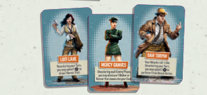

# Espectadores

<figure><figcaption></figcaption></figure>

**Espectadores**\
Los espectadores son personajes clave que los superhéroes deben rescatar de los zombis. Una vez rescatados, se convierten en espectadores escoltados con reglas especiales.

**Espectadores en Peligro**\
Cuando los enemigos se activan, atacan a los espectadores si están en su zona o se mueven hacia ellos si son el objetivo más cercano.

* Se eliminan tras recibir 1 herida.
* No pueden ser dañados por los superhéroes.

**¡Espectador Eliminado!**\
Al eliminarse, los espectadores son retirados y sus cartas descartadas. Esto causa:

* Los superhéroes pierden 1 punto de vida.
* Los superhéroes deben descartar 1 rasgo heroico.

**Activación de Espectadores**\
Durante la fase de enemigos, los espectadores intentan moverse hacia la zona más cercana con superhéroes, siempre que no haya enemigos cerca.

**Espectadores Escoltados**\
Al ser rescatados, los espectadores otorgan beneficios al superhéroe que los escolta:

* Se mueven siempre con él y pueden ser usados para evitar 1 herida.
* Pueden ser intercambiados entre superhéroes.
* Si el superhéroe escoltador es eliminado, vuelven a ser espectadores no rescatados.
