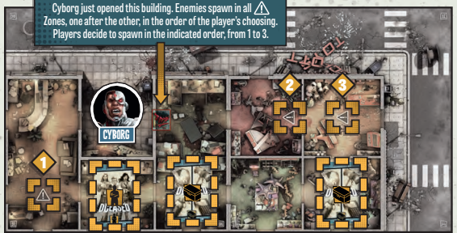

# Turno Enemigo

Al final de la **Fase de Jugador**, donde todos los Superhéroes han sido activados, comienza la **Fase del Enemigo**. En esta fase, los enemigos actúan siguiendo comportamientos automáticos y predefinidos. Estos comportamientos se dividen en dos pasos principales: **Activación de Enemigos** y **Generación de Enemigos**.

<figure><figcaption></figcaption></figure>

***

### 1. Activación de Enemigos

Durante este paso, todos los enemigos que ya se encuentran en el tablero realizan sus acciones. Cada enemigo puede llevar a cabo una de las siguientes acciones en su activación:

* **Atacar** a un Superhéroe o Bystander (Personaje Secundario) si están en la misma zona.
* **Moverse** hacia el Superhéroe o Bystander más cercano si no están en la misma zona que uno.

Después de que todos los enemigos hayan sido activados, los **Bystanders** también se activan.

#### Ataque

Si un enemigo se encuentra en la misma zona que un Superhéroe o un Bystander, realiza un ataque automáticamente. Los ataques de los enemigos son siempre exitosos, por lo que no se requiere lanzar dados para determinar el resultado. Cada ataque inflige **1 herida**.

* Los jugadores pueden distribuir las heridas entre los Superhéroes de la zona como prefieran.
* Los Bystanders solo pueden recibir **1 herida** antes de ser eliminados.

<figure><figcaption></figcaption></figure>

#### Movimiento

Si un enemigo no está en la misma zona que un Superhéroe o Bystander, utiliza su acción para moverse hacia ellos. Los enemigos siempre siguen las reglas de movimiento predeterminadas:

| **Regla de Movimiento**     | **Descripción**                                                                                                                                  |
| --------------------------- | ------------------------------------------------------------------------------------------------------------------------------------------------ |
| **Prioridad de Movimiento** | Los enemigos siempre se dirigen a la zona más cercana que contenga Superhéroes o Bystanders visibles.                                            |
| **Sin línea de visión**     | Si no pueden ver a ningún Superhéroe o Bystander, se mueven hacia la zona más cercana que les permita alcanzarlos siguiendo el camino más corto. |
| **Rutas múltiples**         | Si hay más de un camino con la misma distancia hacia el objetivo, los enemigos se dividen en grupos iguales para seguir todas las rutas.         |

**Ejemplo Visual de Movimiento:**

Aquí te dejo un ejemplo de cómo los enemigos se mueven en función de la distancia y la línea de visión. En este caso, el **Walker** no tiene línea de visión a **Hawkgirl**, por lo que se mueve hacia **Green Arrow** y **Batman**, que sí puede ver.

<figure><figcaption></figcaption></figure>

***

### 2. Generación de Enemigos

Después de que todos los enemigos hayan sido activados, se procede a la **Generación de Enemigos**. Durante este paso, nuevos enemigos aparecen en los puntos de generación activos del tablero. El proceso para generar enemigos sigue estos pasos:

1. Comienza con el primer punto de generación y avanza en el sentido de las agujas del reloj.
2. Roba una carta de generación para cada punto. El número de enemigos que aparecerá se basa en el nivel de peligro del Superhéroe con más experiencia en el grupo.

<figure><figcaption>
Icono de generación de Héroe
</figcaption></figure>

<figure><figcaption>
Icono de generación
</figcaption></figure>

#### Tipos de Cartas de Generación

| **Tipo de Carta**                                                                                                              | **Descripción**                                                                                                                                           |
| ------------------------------------------------------------------------------------------------------------------------------ | --------------------------------------------------------------------------------------------------------------------------------------------------------- |
| **Generación Normal**                                       | La carta muestra el número y tipo de enemigos que deben aparecer en el punto de generación.                                                               |
| 
<strong>Rush</strong>

         | Los enemigos generados por esta carta se activan inmediatamente después de ser colocados en el tablero.                                                   |
| 
<strong>Activación Extra</strong>

 | En lugar de generar nuevos enemigos, todos los enemigos del tipo especificado en la carta realizan una activación extra.                                  |
| 
<strong>Zombie Héroe</strong>

     | Esta carta genera un poderoso Zombie Héroe, que es colocado en el tablero junto con un grupo de zombies normales.                                         |
| **Special Action**                                          | Estas cartas desencadenan una acción especial que puede alterar el flujo normal del juego. Cada carta de acción especial tiene sus propias instrucciones. |

***

### Quedarse sin miniaturas

Es posible que los jugadores se queden sin miniaturas del tipo de enemigo requerido para colocar en el tablero. En ese caso, los enemigos restantes del tipo indicado se colocan en el tablero (si hay alguno disponible). Luego, **todos los enemigos** de ese tipo resuelven una **activación extra**.

* ¡Ojo! Múltiples activaciones extra pueden ocurrir seguidas, así que es importante mantener el control sobre la población de enemigos en el tablero.

<figure><figcaption></figcaption></figure>

***

### Generación en Edificios

Cuando se abre un **edificio cerrado** por primera vez, se revelan todos los enemigos y **Bystanders** que esperan dentro. Un edificio se extiende por todas las habitaciones conectadas por aberturas, a veces cubriendo varias losetas. Las puertas cerradas crean separaciones entre los edificios.

1. Los enemigos dentro de un edificio solo aparecen en las **zonas marcadas** con el icono de generación.

<figure><figcaption></figcaption></figure>

2. Roba y resuelve 1 carta de generación por cada una de estas zonas, una tras otra, en el orden que elijan los jugadores (se sugiere comenzar desde la zona más lejana hasta la más cercana).
3. Una vez que se hayan generado todos los enemigos, revela cualquier carta de **Bystander** dentro de ese edificio y reemplázala con la miniatura correspondiente.
4. Las cartas de **Equipo** no se revelan hasta que son recogidas por un Superhéroe.

***

#### Ejemplos Visuales

Aquí tienes una representación visual de cómo se generan los enemigos al abrir un edificio por primera vez.

<figure><figcaption></figcaption></figure>

<figure><figcaption></figcaption></figure>

***

### Consejos de Estrategia

Al abrir edificios, coordina tus movimientos para no quedar rodeado. Los enemigos pueden aparecer en grandes cantidades, así que es recomendable planificar de antemano cuántos Superhéroes se encargan de eliminar los puntos de generación dentro de los edificios.

***

En esta fase, los enemigos actúan siguiendo comportamientos automáticos y predefinidos. Estos comportamientos se dividen en dos pasos principales: **Activación de Enemigos** y **Generación de Enemigos**.

<figure><figcaption></figcaption></figure>

***

### 1. Activación de Enemigos

Durante este paso, todos los enemigos que ya se encuentran en el tablero realizan sus acciones. Cada enemigo puede llevar a cabo una de las siguientes acciones en su activación:

* **Atacar** a un Superhéroe o Bystander (Personaje Secundario) si están en la misma zona.
* **Moverse** hacia el Superhéroe o Bystander más cercano si no están en la misma zona que uno.

Después de que todos los enemigos hayan sido activados, los **Bystanders** también se activan.

#### Ataque

Si un enemigo se encuentra en la misma zona que un Superhéroe o un Bystander, realiza un ataque automáticamente. Los ataques de los enemigos son siempre exitosos, por lo que no se requiere lanzar dados para determinar el resultado. Cada ataque inflige **1 herida**.

* Los jugadores pueden distribuir las heridas entre los Superhéroes de la zona como prefieran.
* Los Bystanders solo pueden recibir **1 herida** antes de ser eliminados.

<figure><figcaption></figcaption></figure>

#### Movimiento

Si un enemigo no está en la misma zona que un Superhéroe o Bystander, utiliza su acción para moverse hacia ellos. Los enemigos siempre siguen las reglas de movimiento predeterminadas:

| **Regla de Movimiento**     | **Descripción**                                                                                                                                  |
| --------------------------- | ------------------------------------------------------------------------------------------------------------------------------------------------ |
| **Prioridad de Movimiento** | Los enemigos siempre se dirigen a la zona más cercana que contenga Superhéroes o Bystanders visibles.                                            |
| **Sin línea de visión**     | Si no pueden ver a ningún Superhéroe o Bystander, se mueven hacia la zona más cercana que les permita alcanzarlos siguiendo el camino más corto. |
| **Rutas múltiples**         | Si hay más de un camino con la misma distancia hacia el objetivo, los enemigos se dividen en grupos iguales para seguir todas las rutas.         |

**Ejemplo Visual de Movimiento:**

Aquí te dejo un ejemplo de cómo los enemigos se mueven en función de la distancia y la línea de visión. En este caso, el **Walker** no tiene línea de visión a **Hawkgirl**, por lo que se mueve hacia **Green Arrow** y **Batman**, que sí puede ver.

<figure><figcaption></figcaption></figure>

***

### 2. Generación de Enemigos

Después de que todos los enemigos hayan sido activados, se procede a la **Generación de Enemigos**. Durante este paso, nuevos enemigos aparecen en los puntos de generación activos del tablero. El proceso para generar enemigos sigue estos pasos:

1. Comienza con el primer punto de generación y avanza en el sentido de las agujas del reloj.
2. Roba una carta de generación para cada punto. El número de enemigos que aparecerá se basa en el nivel de peligro del Superhéroe con más experiencia en el grupo.

<figure><figcaption>
Icono de generación de Héroe
</figcaption></figure>

<figure><figcaption>
Icono de generación
</figcaption></figure>

#### Tipos de Cartas de Generación

| **Tipo de Carta**                                                                                                                                        | **Descripción**                                                                                                                                           |
| -------------------------------------------------------------------------------------------------------------------------------------------------------- | --------------------------------------------------------------------------------------------------------------------------------------------------------- |
| **Generación Normal** .png>)                                                                                           | La carta muestra el número y tipo de enemigos que deben aparecer en el punto de generación.                                                               |
| 
<strong>Rush</strong>

 
                                                                 | Los enemigos generados por esta carta se activan inmediatamente después de ser colocados en el tablero.                                                   |
| 
<strong>Activación Extra</strong> 

 | En lugar de generar nuevos enemigos, todos los enemigos del tipo especificado en la carta realizan una activación extra.                                  |
| 
<strong>Zombie Héroe</strong>

 
                                                         | Esta carta genera un poderoso Zombie Héroe, que es colocado en el tablero junto con un grupo de zombies normales.                                         |
| 
<strong>Special Action</strong> 

                                  | Estas cartas desencadenan una acción especial que puede alterar el flujo normal del juego. Cada carta de acción especial tiene sus propias instrucciones. |

***

### Quedarse sin miniaturas

Es posible que los jugadores se queden sin miniaturas del tipo de enemigo requerido para colocar en el tablero. En ese caso, los enemigos restantes del tipo indicado se colocan en el tablero (si hay alguno disponible). Luego, **todos los enemigos** de ese tipo resuelven una **activación extra**.

* ¡Ojo! Múltiples activaciones extra pueden ocurrir seguidas, así que es importante mantener el control sobre la población de enemigos en el tablero.

<figure><figcaption></figcaption></figure>

***

### Generación en Edificios

Cuando se abre un **edificio cerrado** por primera vez, se revelan todos los enemigos y **Bystanders** que esperan dentro. Un edificio se extiende por todas las habitaciones conectadas por aberturas, a veces cubriendo varias losetas. Las puertas cerradas crean separaciones entre los edificios.

1. Los enemigos dentro de un edificio solo aparecen en las **zonas marcadas** con el icono de generación.

<figure><figcaption></figcaption></figure>

2. Roba y resuelve 1 carta de generación por cada una de estas zonas, una tras otra, en el orden que elijan los jugadores (se sugiere comenzar desde la zona más lejana hasta la más cercana).
3. Una vez que se hayan generado todos los enemigos, revela cualquier carta de **Bystander** dentro de ese edificio y reemplázala con la miniatura correspondiente.
4. Las cartas de **Equipo** no se revelan hasta que son recogidas por un Superhéroe.

***

#### Ejemplos Visuales

<figure><figcaption></figcaption></figure>

<figure><figcaption></figcaption></figure>

***

### Consejos de Estrategia

Al abrir edificios, coordina tus movimientos para no quedar rodeado. Los enemigos pueden aparecer en grandes cantidades, así que es recomendable planificar de antemano cuántos Superhéroes se encargan de eliminar los puntos de generación dentro de los edificios.

***

***
